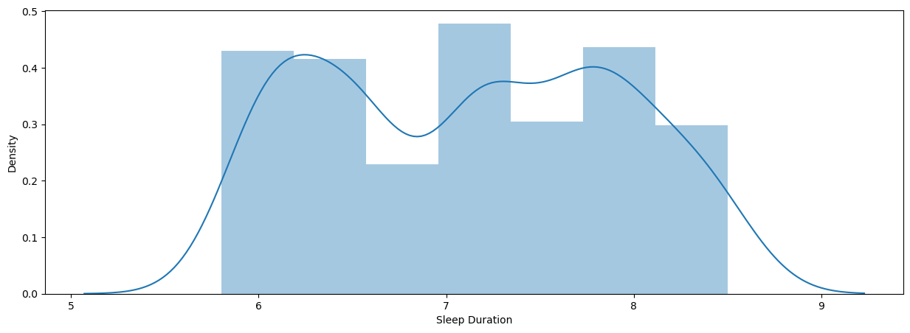

# Laporan Proyek Machine Learning
### Nama : Muhamad Ramadhan Darmawan
### Nim : 211351089
### Kelas : Pagi B

## Domain Proyek

Aplikasi pendeteksi gangguan atau kelainan tidur adalah salah satu hasil perkembangan teknologi yang bertujuan untuk membantu individu mengidentifikasi masalah tidur yang mungkin mereka alami

**Rubrik/Kriteria Tambahan (Opsional)**:
- Studi ilmiah semakin menunjukkan bahwa tidur yang cukup dan berkualitas sangat penting bagi kesehatan dan kesejahteraan. Gangguan tidur, seperti sleep apnea, insomnia, atau narcolepsy, dapat memiliki dampak serius terhadap kesehatan jangka panjang.
- Tidur sendiri dapat diartikan sebagai suatu kondisi yang ditandai oleh kesadaran yang menurun, namun aktivitas hati tetap memainkan peran yang luar biasa dalam mengatur berbagai fungsi fisiologis, psikologis maupun spiritual manusia
  
  Format Referensi: [Psikologi Tidur : Dari Kualitas Tidur Hingga Insmonia](https://dspace.uii.ac.id/bitstream/handle/123456789/6312/978-602-450-080-1.pdf?sequence=3) 

## Business Understanding

### Problem Statements

Menjelaskan pernyataan masalah latar belakang:
- Kita seringkali mengabaikan tentang pentingnya kualitas tidur
- Tidak mengetahui apakah kita memiliki kelainan tidur

### Goals

Menjelaskan tujuan dari pernyataan masalah:
- Tidur yang berkualitas sangat penting bagi kesehatan dan kesejahteraan secara keseluruhan sebagai contoh pemulihan fisik, kesehatan mental, konsentrasi dan produktivitas, daya tahan tubuh dan masih banyak lagi
- Membuat aplikasi pendeteksi kelainan pada tidur dikarenakan jauh lebih mudah dan murah dibandingkan kita harus mengecek kesehatan kita ke rumah sakit

## Data Understanding
Dataset yang saya gunakan bersumber dari kaggle yang memuat mengenai data yang dibutuhkan untuk menganalisis apakah kita memiliki kelainan dalam tidur memiliki 13 atribut dan 400 data

Link Dataset : [Sleep Health and Lifestyle Dataset](https://www.kaggle.com/datasets/uom190346a/sleep-health-and-lifestyle-dataset).<br> 

Selanjutnya terdapat 13 variabel atau fitur pada data. Yaitu:  

### Variabel-variabel pada Heart Failure Prediction Dataset adalah sebagai berikut:
- Person ID : merupakan identitas pada setiap individu. (int64, unique)
- Sex : merupakan jenis kelamin pasien meliputi [M: Male, F: Female].(object)
- Age : rentang usia pada setiap individu. (int64)
- Occupation : pekerjaan yang dimiliki. (object)
- Sleep Duration : durasi tidur dalam bentuk jam. (float)
- Quality of Sleep : penilaian subjektif dengan skala 1 - 10. (int64)
- Physical Activity Level : aktivitas fisik yang dilakukan dalam jumlah menit. (int64)
- Stress Level : level stress yang dialami oleh individu skala 1 - 10. (int64)
- BMI Category : indeks massa seseorang dari kurus, normal, dan obesitas, (int64)
- Blood Pressure : Tekanan Darah. (int64)
- Heart Rate : rata - rata detak jantung dalam satuan bpm. (int64)
- Daily Steps : langkah kaki yang dilakukan per hari. (int64)
- Sleep Disorder : Ada tidaknya gangguan tidur pada orang tersebut (Binary)

## Data Preparation
Kita import library yang akan kita gunakan dalam program yang akan kita bangun
``` bash
import numpy as np
import pandas as pd
import matplotlib.pyplot as plt
import seaborn as sns
```
kemudian kita import dataset yang sudah kita download dari kaggle yang akan kita tampung dalam variable data kemudian tampilkan 5 data awal dari dataset tersebut
``` bash
data = pd.read_csv("Sleep_health_and_lifestyle_dataset.csv")
data.head()
```
untuk melihat jumlah data, rata - rata, standar, nilai minimal, nilai 25%, nilai 50%, nilai 75%, nilai maksimum dari dataset
``` bash
data.describe()
```
untuk mengetahui atribut dan dengan tipe data apa saja yang terdapat dalam dataset
``` bash
data.info()
```
kita lihat apakah ada data yang bernilai null dalam dataset lalu ditampilkan dalam tabel heatmap
``` bash
sns.heatmap(data.isnull())
```
<br>
kemudian untuk melihat korelasi data untuk mengetahui apakah data yang satu dengan yang lainnya saling keterhubungan
``` bash
plt.figure(figsize=(10,8))
sns.heatmap(data.corr(), annot=True)
```
<br>
lalu kita buat variable model untuk menjadikan atribut pekerjaan sebagai kunci kemudian ditampilkan dengan barplot
``` bash
models = data.groupby('Occupation').count()[['Age']].sort_values(by='Age',ascending=True).reset_index()
models = models.rename(columns={'Age':'Stress Level'})
fig= plt.figure(figsize=(15,5))
sns.barplot(x=models['Occupation'], y=models['Stress Level'], color='royalblue')
plt.xticks(rotation=60)
```
<br>
tampilkan atribut durasi tidur dalam dist plot
``` bash
plt.figure(figsize=(15,5))
sns.distplot(data['Sleep Duration'])
```
<br>
tampilkan atribut tidur yang berkualitas dalam dist plot
``` bash
plt.figure(figsize=(15,5))
sns.distplot(data['Sleep Duration'])
```
<br>
membuat grafik batang (bar chart) yang menunjukkan rata-rata tingkat stres berdasarkan gender (jenis kelamin) dari dataset
``` bash
gender_stress = data.groupby('Gender')['Stress Level'].mean()
x = np.arange(len(gender_stress))
width = 0.35
plt.figure(figsize=(8, 6))
plt.bar(x, gender_stress, width, label='Stress Level', color=['blue', 'green'])
plt.xlabel('Gender')
plt.ylabel('Average Stress Level')
plt.title('Stress Level by Gender')
plt.xticks(x, gender_stress.index)
plt.legend()
plt.show()
```
<br>

## Modeling
Model yang saya gunakan adalah model regresi logistik yaitu model statistik yang menggunakan fungsi logistik, atau fungsi logit, dalam matematika sebagai persamaan antara x dan y

### Deklarasi variable dependent dan variable independent (label)
pertama kita pisahkan atribut apasaja yang akan kita gunakan dari dataset lalu kita tampung dalam sebuah variable features lalu kita gunakan untuk variable x (input) sedangkan variable y (label) kita gunakan atribut Sleep Disorder
``` bash
features = ['Age', 'Sleep Duration', 'Quality of Sleep', 'Physical Activity Level', 'Stress Level', 'Heart Rate', 'Daily Steps']
x = data[features]
y = data['Sleep Disorder']
```

### Pemisahan Data
sebelumnya kita import dulu library yang akan kita gunakan untuk pemisahan data training dan data testing lalu kemudian kita pisahkan data training sebesar 20% dan data testing sebesar 80%
``` bash
from sklearn.model_selection import train_test_split
x_train, x_test, y_train, y_test = train_test_split(x, y, test_size=0.2, stratify=y, random_state=2)
```

### Pemodelan Regresi Logistik
kita import library terlebih dahulu yang akan kita gunakan sebagai model dan kemudian disesuaikan/diisi dengan data training
``` bash
from sklearn.linear_model import LogisticRegression
model = LogisticRegression()
model.fit(x_test,y_test)
```

## Evaluation
Pada bagian ini saya menggunakan metrik evaluasi accuracy score untuk menunjukan akurasi skore yang kita dapatkan dari model regresi yang sudah kita latih dengan data latih dan kita tampilkan akurasi yang kita dapatkan yaitu sekitar 90%
``` bash
x_train_predict = model.predict(x_train)
training_data_accuracy = accuracy_score(x_train_predict, y_train)
print('Akurasi data training dengan model logistic regression adalah =',training_data_accuracy)
```
dan kemudian kita tampilkan juga skor akurasi model regresi logistik dengan data testing dan skor akurasi yang kita dapatkan sekitar 93%
``` bash
x_test_predict = model.predict(x_test)
testing_data_accuracy = accuracy_score(x_test_predict, y_test)
print('Akurasi data testing menggunakan model logistic regression adalah =', testing_data_accuracy)
```
lalu kemudian kita coba model ini dengan cara memasukan data yang terdapat pada dataset apakah label yang didapatkan sesuai dengan apa yang tertera dengan dataset

``` bash
input_data =(28, 5.9, 4, 30, 8, 85, 3000)
dataasarray = np.asarray(input_data)
reshape = dataasarray.reshape(1, -1)
prediction = model.predict(reshape)
print(prediction)

if(prediction[0]==0):
    print('Pasien Tidak Menderita Gangguan Tidur')
else:
    print('Pasien Menderita Gangguan Tidur')
```
jika sudah sesuai kemudian kita ekspor model ini yang kemudian akan kita load dalam file py dengan import library terlebih agar proses ekspor file model ini bisa dilakukan
``` bash
import pickle
filename = 'gangguantidur.sav'
pickle.dump(model, open(filename, 'wb'))
```

## Deployment
Setelah kita berhasil memuat model kemudian kita luncurkan aplikasi dan disebarkan di stremlit share<br>
Link Aplikasi : [Prediksi Gangguan Tidur](https://tugasuts-6xh2nkusaalerdic3tt7en.streamlit.app/)

**---Ini adalah bagian akhir laporan---**
